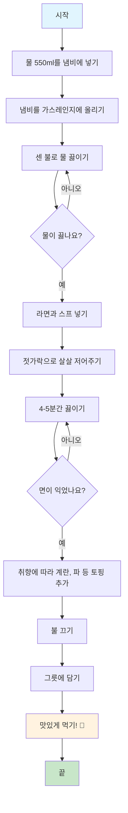

# init

```mermaid
flowchart TD
    A[시작] --> B[물 550ml를 냄비에 넣기]
    B --> C[냄비를 가스레인지에 올리기]
    C --> D[센 불로 물 끓이기]
    D --> E{물이 끓나요?}
    E -->|아니오| D
    E -->|예| F[라면과 스프 넣기]
    F --> G[젓가락으로 살살 저어주기]
    G --> H[4-5분간 끓이기]
    H --> I{면이 익었나요?}
    I -->|아니오| H
    I -->|예| J[취향에 따라 계란, 파 등 토핑 추가]
    J --> K[불 끄기]
    K --> L[그릇에 담기]
    L --> M[맛있게 먹기! 🍜]
    M --> N[끝]

    style A fill:#e1f5fe
    style N fill:#c8e6c9
    style M fill:#fff3e0
```